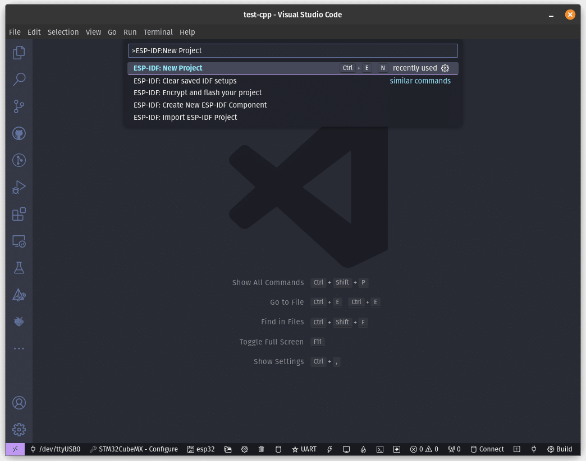
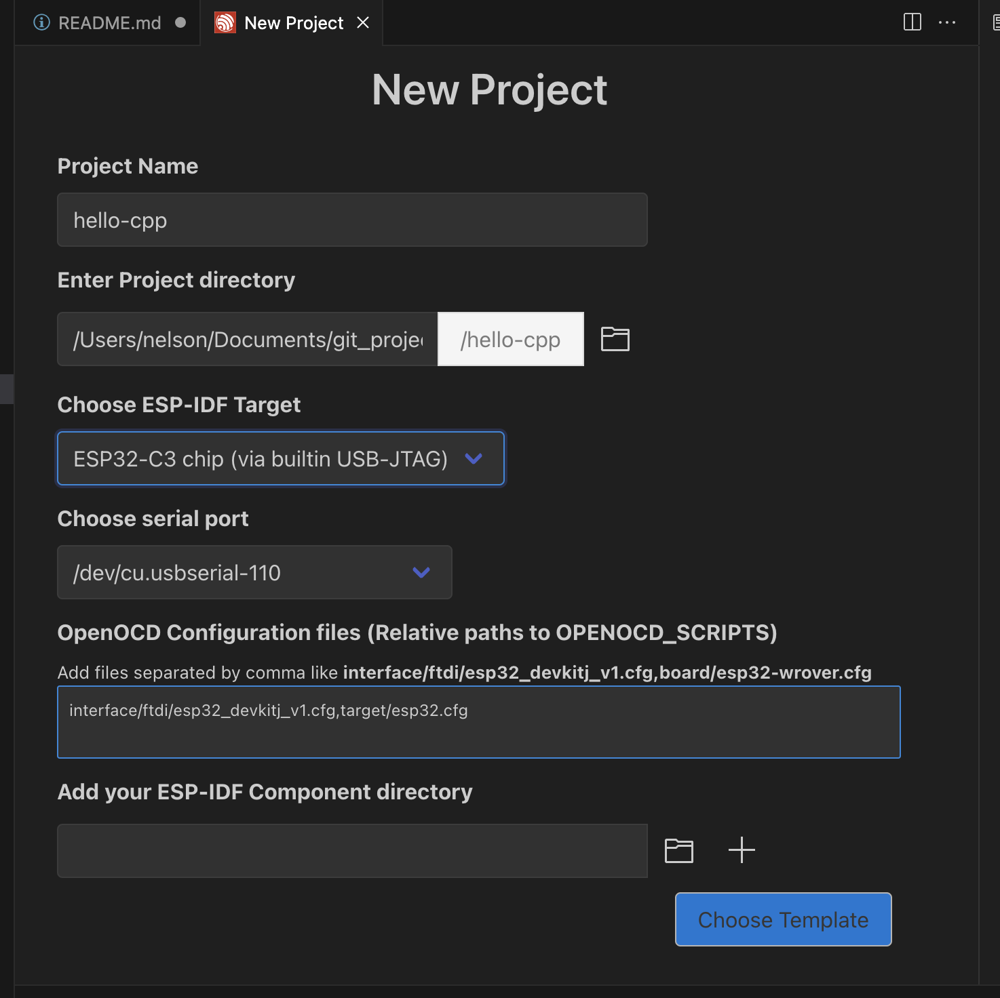

# _Sample project_

Projeto simples, mostrando a configuração minima para um projeto em C++

# Preparando o Ambiente
Para prosseguir, o ESP-IDF já deve ter sido instalado no sistema junto com o VSCode, então agora é a hora de fazê-lo caso ainda não o tenha feito.

Com o ESP-IDF devidamente instalado no sistema e adicionado como extensão no VSCode, deve-se começar a preparar o ambiente para começar a trabalhar com C++. Primeiro, deve-se iniciar um novo projeto na ESP-IDF a partir do exemplo Sample Project, que já vem com todas as configurações necessárias para começar um novo projeto.

Para isso, deve-se seguir os seguintes passos:

Abra o VSCode, aperte F1 e digite ESP-IDF: New Project;



Agora, nomeie o projeto e salve-o como quiser. Aqui, o nomeamos como “hello-cpp”;



Na caixa de seleção acima dos templates disponíveis, selecione **ESP-IDF** e depois **sample_project**. Esse exemplo já vem com todas as configurações necessárias para criar um novo projeto. Com isso, clique em **Create project using sample_project**.


Finalmente, essa caixa de diálogo irá aparecer no canto inferior direito da janela do VSCode. Aperte Yes para abrir o projeto recém-criado em uma nova janela.


- Renomear o arquivo main.c para main.cpp. 

> **Observação:** Existe um componente chamado esp-idf-cxx, que não instalei. É um componente da Espressif para o ESP-IDF que permite o uso de várias bibliotecas e APIs em C++, sendo bem útil para ser usado em projetos C++. Se quiser instalar, ir até o botão ESP-IDF: Open ESP-IDF Terminal, localizado na parte inferior do ambiente do VSCode.


No terminal aberto, digite o seguinte comando e aperte Enter para instalar o componente:

```bash
idf.py add-dependency "espressif/esp-idf-cxx^1.0.2-beta"Exite um componente necessário para 
```

depois em main.cpp, fiz o seguinte:
```cpp
#include "freertos/FreeRTOS.h"
#include "freertos/task.h"

#define LOG_LOCAL_LEVEL ESP_LOG_INFO
#include "esp_log.h"
```

o FreeRTOS busca a função app_main, então é preciso linkar a função app_main com a função main. Para isso, adicione o seguinte código no final do arquivo main.cpp:

```cpp
extern "C" void app_main(void)
```

# Criando a pasta components

Finalmente, deve-se criar uma nova pasta chamada components na raiz do projeto. É nessa pasta que serão inseridos os objetos utilizados como componentes personalizados do ESP-IDF, deixando o projeto mais organizado e tornando mais fácil realizar a portabilidade dos objetos para serem reutilizados em outros projetos. Com isso, deve-se abrir o arquivo **CMakeLists.txt** localizado na raiz do projeto (cuidado para não confundir com o arquivo CMakeLists.txt na pasta main) e acrescente a seguinte linha no arquivo:

```cmake
set(EXTRA_COMPONENT_DIRS components)
```

Essa linha serve para sinalizar ao **CMake** onde está a pasta de componentes recém-criada, para que estes possam ser incluídos corretamente ao projeto. O arquivo após a adição deve ficar nestes moldes:

```cmake
# For more information about build system see
# https://docs.espressif.com/projects/esp-idf/en/latest/api-guides/build-system.html
# The following five lines of boilerplate have to be in your project's
# CMakeLists in this exact order for cmake to work correctly
cmake_minimum_required(VERSION 3.16)
include($ENV{IDF_PATH}/tools/cmake/project.cmake)
project(hello-cpp)
set(EXTRA_COMPONENT_DIRS components)
```

Com o ambiente preparado, pode-se seguir com a criação dos componentes que serão utilizados no projeto.

